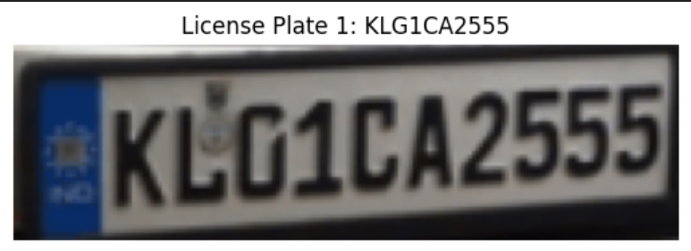
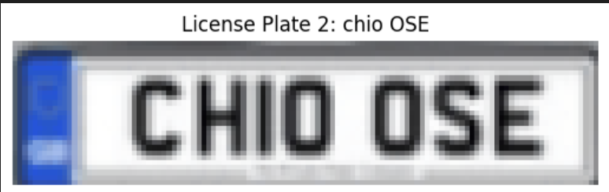
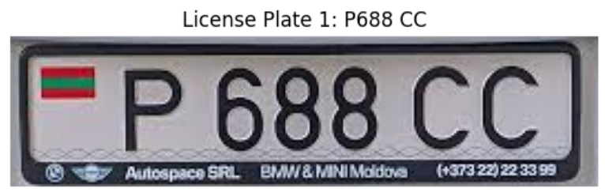

# License-Plate-Recognition-System

This repository contains two Python scripts for Automatic Number Plate Recognition (ANPR): `ANPR_Image.py` and `ANPR_Video.py`. These scripts utilize YOLO for object detection and EasyOCR for text recognition to identify license plates from images and videos.


## Features

- **ANPR_Image.py**: Processes single images to detect and read license plates.
- **ANPR_Video.py**: Processes video files, detecting and recognizing license plates in real-time.
- Utilizes a pre-trained YOLO model for license plate detection.
- Implements EasyOCR for Optical Character Recognition (OCR) on detected plates.
- Outputs detected plates with bounding boxes and recognized text overlaid on the original image or video.

## Model Training

The YOLO model has been trained on **25,000+ annotated images** to accurately detect license plates.

The training results are illustrated in the graphs below:

)


## Results

The following images demonstrate the results of the ANPR system:





You can view the video result demonstrating the license plate detection and recognition in action:

[Watch Video Result](Result/output_video.avi)

## Installation

To run this project, ensure you have the following libraries installed:

```bash
pip install -r requirements.txt
